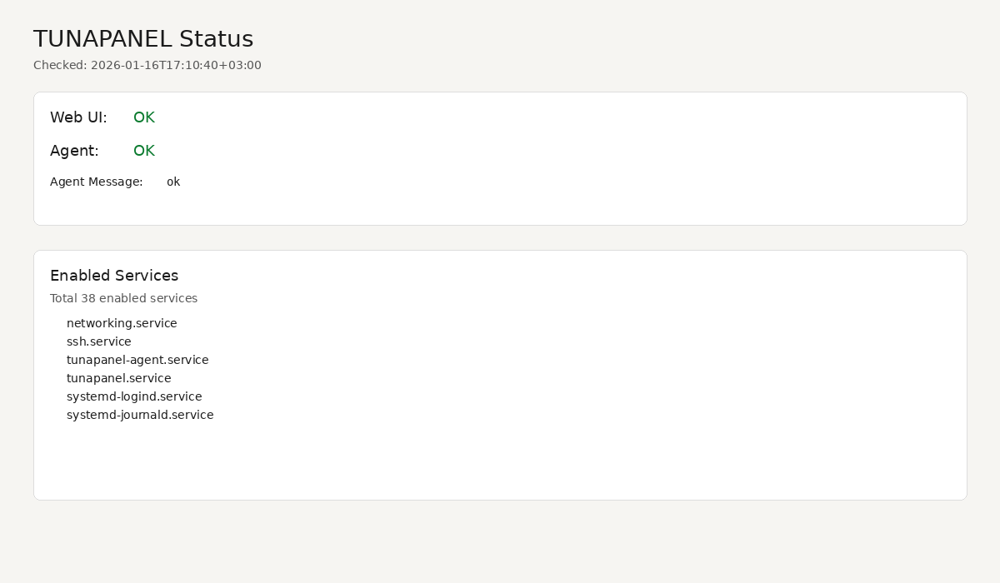

# TUNAPANEL (MVP-0)

Minimal, local-first server control panel components.

Local, read-only system control panel (no remote access).

## Quick Start

```bash
sudo dpkg -i tunapanel_0.1.4_amd64.deb
sudo systemctl enable --now tunapanel-agent
sudo systemctl enable --now tunapanel
```

Open:

`http://127.0.0.1:8080/`

## Screenshot



Screenshot is taken from a local demo system.

## Build

```sh
go build ./cmd/tunapanel-agent
go build ./cmd/tunactl
go build ./cmd/tunapanel
```

## Run

Start the agent as root (required):

```sh
sudo ./tunapanel-agent
```

Use the CLI as a regular user:

```sh
./tunactl status
./tunactl service list
./tunactl service start nginx
./tunactl service stop nginx
./tunactl --dry-run service start nginx
```

## Web UI (Read-Only)

Run the web UI as a regular user (binds to `127.0.0.1:8080`):

```sh
./tunapanel
```

The web UI handles SIGTERM/SIGINT with a 5s graceful shutdown.

Endpoints:

- `GET /health`
- `GET /status`
- `GET /services` (default: enabled)
- `GET /services?state=running`

## Binaries

- `tunapanel-agent`: privileged system agent (root only)
- `tunactl`: CLI client (non-root)
- `tunapanel`: read-only web UI (non-root)

## Socket and Logs

- Socket: `/run/tunapanel/agent.sock`
- Agent log: `/var/log/tunapanel/agent.log`
- Audit log: `/var/log/tunapanel/audit.log`

For non-root access, create a `tunapanel` group and add your user, then restart the agent:

```sh
sudo groupadd tunapanel
sudo usermod -aG tunapanel $USER
```

Rate limit is enforced per UID (default: 5 requests/second).

## Logrotate

The package installs `/etc/logrotate.d/tunapanel` to rotate `agent.log` and `audit.log` weekly (8 rotations) with compression and `root:tunapanel` permissions (0640).

## Systemd + tmpfiles.d

Install the unit and tmpfiles definitions:

```sh
sudo install -D -m 0644 packaging/systemd/tunapanel-agent.service /etc/systemd/system/tunapanel-agent.service
sudo install -D -m 0644 packaging/systemd/tunapanel.service /etc/systemd/system/tunapanel.service
sudo install -D -m 0644 packaging/tmpfiles/tunapanel.conf /etc/tmpfiles.d/tunapanel.conf
sudo systemd-tmpfiles --create /etc/tmpfiles.d/tunapanel.conf
sudo systemctl daemon-reload
sudo systemctl enable tunapanel-agent
sudo systemctl start tunapanel-agent
sudo systemctl status tunapanel-agent
```

Optional web UI unit (runs non-root with a dynamic user and `tunapanel` group):

```sh
sudo systemctl enable --now tunapanel
sudo systemctl status tunapanel
```

The web UI unit uses a dynamic user named `tunapanel-web` and joins the `tunapanel` group for socket access.

This setup assumes binaries are installed at `/usr/bin/tunapanel-agent` and `/usr/bin/tunactl`.

tmpfiles.d ensures `/run/tunapanel` exists at boot with the correct ownership and permissions, and applies permissions to the socket when it appears.

## Reboot Test Checklist

- `systemctl is-enabled tunapanel-agent`
- `systemctl status tunapanel-agent`
- `ls -ld /run/tunapanel`
- `ls -l /run/tunapanel/agent.sock`
- `tunactl status`
